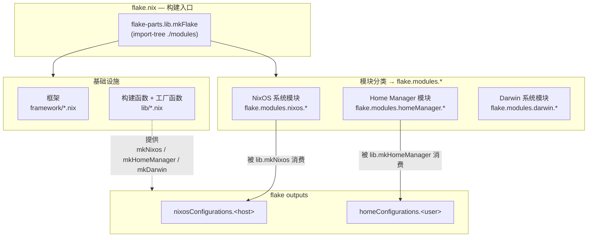
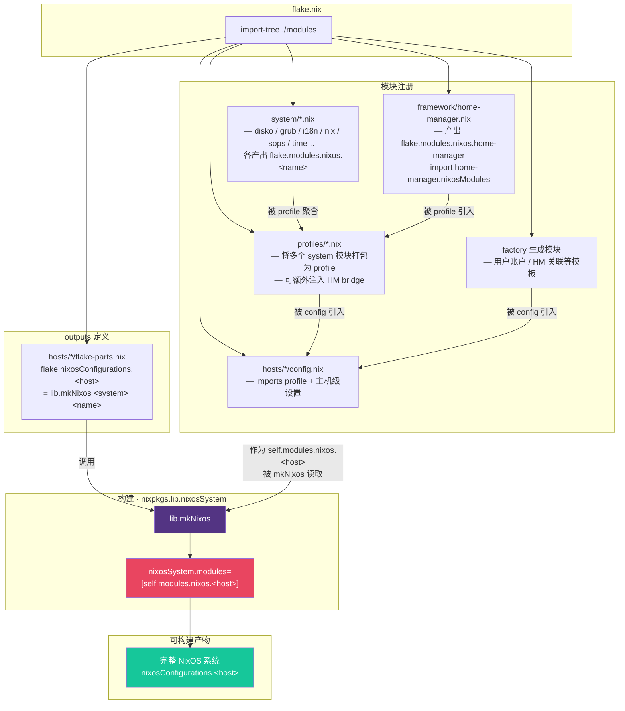
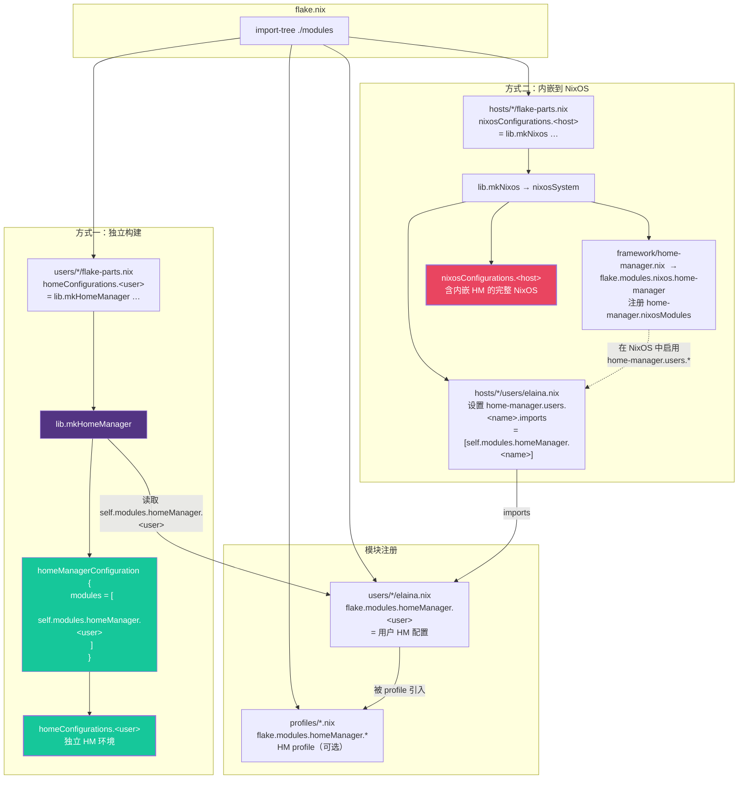

# Module System Architecture

## 1. 概览



所有 `.nix` 文件通过 `import-tree ./modules` 被 flake.nix 统一加载，各自贡献到 `flake.modules.*`、`flake.lib.*`、`flake.nixosConfigurations` 等属性上。

---

## 2. `flake.modules.nixos.*` 途径



### 分层汇聚关系

```
system/*.nix      ──→ flake.modules.nixos.<功能>     (单一功能)
profiles/*.nix    ──→ flake.modules.nixos.<profile>   (功能聚合)
hosts/*/config.nix ──→ flake.modules.nixos.<host>     (主机全集)
```

最终 `lib.mkNixos` 将 `self.modules.nixos.<host>` 传给 `nixpkgs.lib.nixosSystem`。

---

## 3. `flake.modules.homeManager.*` 途径



### 两种使用方式

| 方式 | 产出 | 适用场景 |
|---|---|---|
| **独立构建** | `homeConfigurations.<user>` | 非 NixOS 系统、单独测试 |
| **内嵌到 NixOS** | `nixosConfigurations.<host>` 内含 HM | NixOS 生产环境 |

内嵌链路：`framework/home-manager.nix` 产出 `flake.modules.nixos.home-manager`（即 NixOS 端的 HM 入口），被 profile 引入 NixOS 系统后，主机用户模块通过 `home-manager.users.<name>.imports` 指向 `self.modules.homeManager.<name>`。
